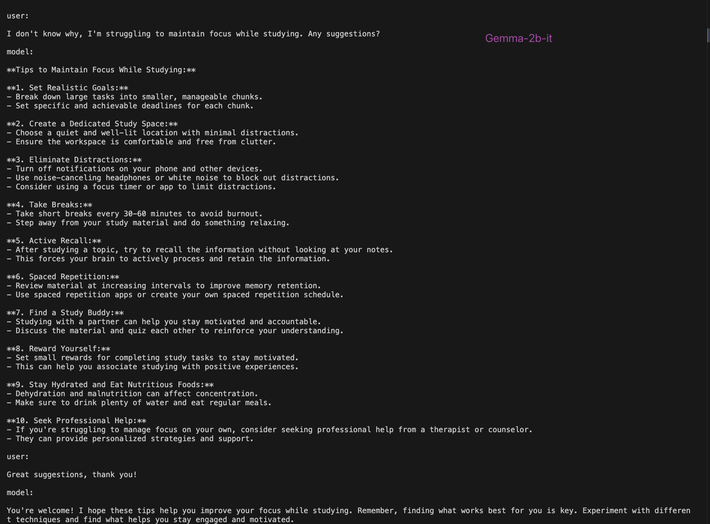
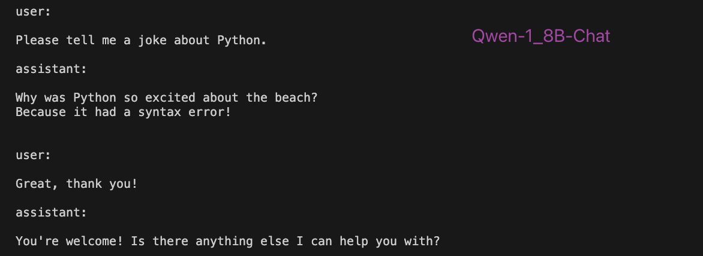

# pytorch-llm-infer

Oh my own pytorch implementation (from scratch) of some famous large language models (LLM) for inference purposes only. Just a project for practice and learning, DO NOT use it in serious applications.

# How to use

- download model file to *checkpoints* directory from huggingface
- modify *pipeline.py* to adapt to your test running
- run `python pipeline.py`

# Results

**Gemma**

**Qwen**

# Features

##  Features Already Added

- KV caching
    - [x] static cache
    - [ ] paged cache
- Sampling method
    - [x] temperature
    - [x] top_k
    - [ ] top_p
    - [ ] repetition_penalty
    - [ ] beam search
- Position Embedding
    - [x] rotary position embeddings
    - [x] partial rotory position embeddings
- Attention Mechanism
    - [x] multi-head
    - [x] multi-query
    - [x] group-query 
- Decoding
    - [x] [speculative_decoding](https://github.com/jzhang38/TinyLlama/blob/main/speculative_decoding/instruct_hf_assisted_decoding.py)
    - [ ] [Jacobi decoding]()
    - [ ] [Look ahead decoding]()
- [ ] Quantization
- [ ] context window extension 
- [ ] continuous batching
- [ ] Streamer like huggingface transformers

## Supported Models

- [x] [tinyllama](https://huggingface.co/TinyLlama/TinyLlama-1.1B-Chat-v1.0)
- [x] [phi-2](https://huggingface.co/microsoft/phi-2), [phi-1_5](https://huggingface.co/microsoft/phi-1_5)
- [x] [qwen](https://huggingface.co/Qwen)
- [x] [Gemma](https://huggingface.co/google/gemma-2b-it) *20230222*
- [x] [llama2](https://huggingface.co/meta-llama)
- [ ] [OLMo](https://huggingface.co/allenai/OLMo-1B)

## Coffee

Please buy me a [:coffee:](https://ko-fi.com/excitingme) if you find this project useful. 
